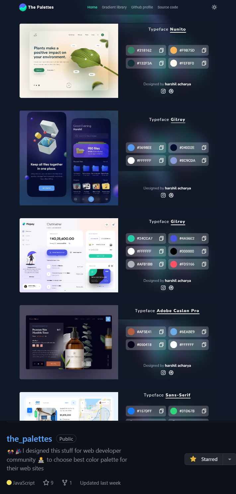
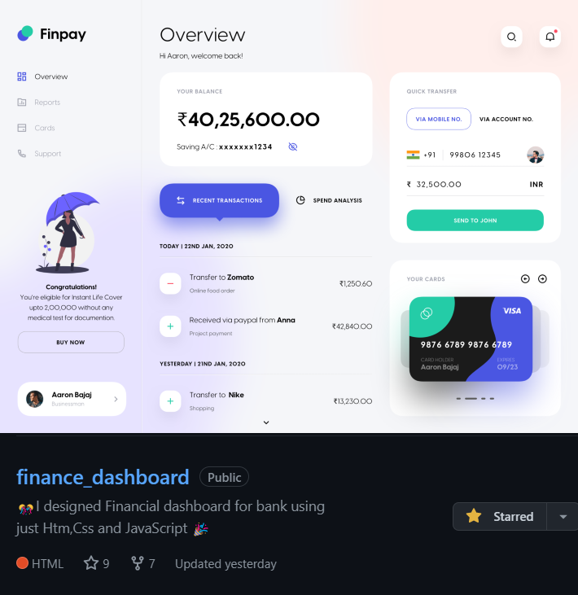
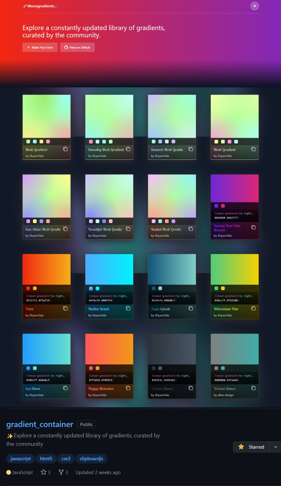
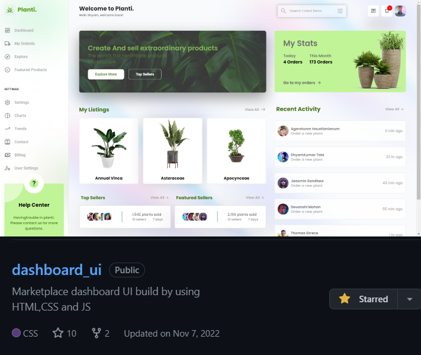
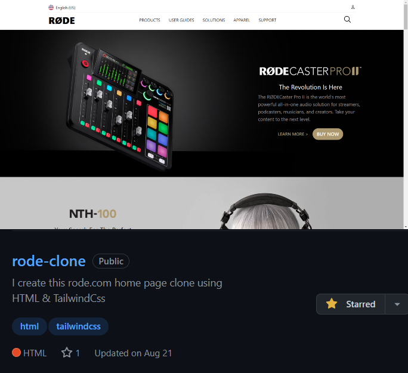
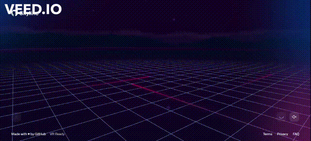

<h1 align="center">Hi 👋, I'm Shyam Tala</h1>
<h3 align="center">A passionate frontend developer from India(Gujarat)</h3>

 

  

- 🌱 I’m currently learning **ReactJs,MongoDB,NodeJs and ExpressJs**

- 👨‍💻 All of my projects are available at [https://shyamtala.netlify.app/](https://shyamtala.netlify.app/)

- 📝 I regularly write articles on [https://hashnode.com/@ShyamtTala](https://hashnode.com/@ShyamtTala)

- 💬 Ask me about **Html , Css , Js , ReactJs**

- 📫 How to reach me **shyamtala003@gmail.com**

- ⚡ Fun fact **By Profesion I am a Web Developer but by Passion I am a Farmer**

<h3 align="left">Connect with me:</h3>

    
    
    
    

<h3 align="left">Languages and Tools:</h3>

 <a href="https://getbootstrap.com" target="_blank" rel="noreferrer">

 

 

  
 
 
 
   
          

 

<h2 align="center">My favorite projects 💻</h2>
 

I was asked about these projects a lot during my interviews - so check them out.

 
 

  

  
  
  

  

  

  

  
  
<!-- ### Readme Streak Stats.
 -->

 

## 
### Watch my contribution graph get eaten by the snake 🐍

